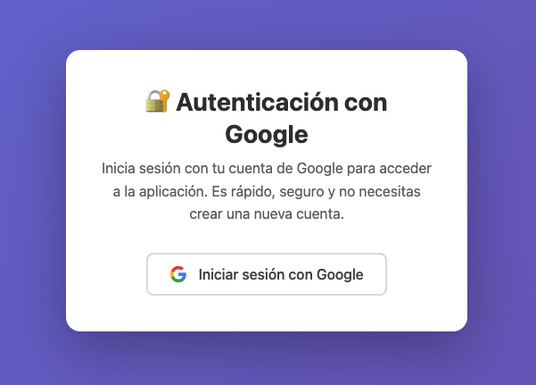
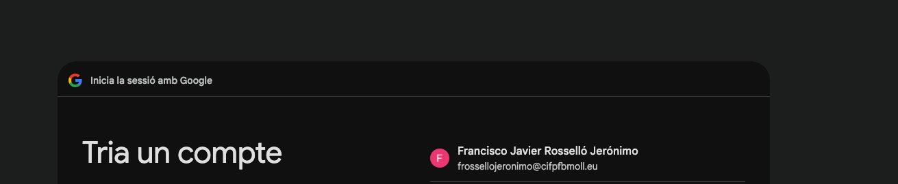
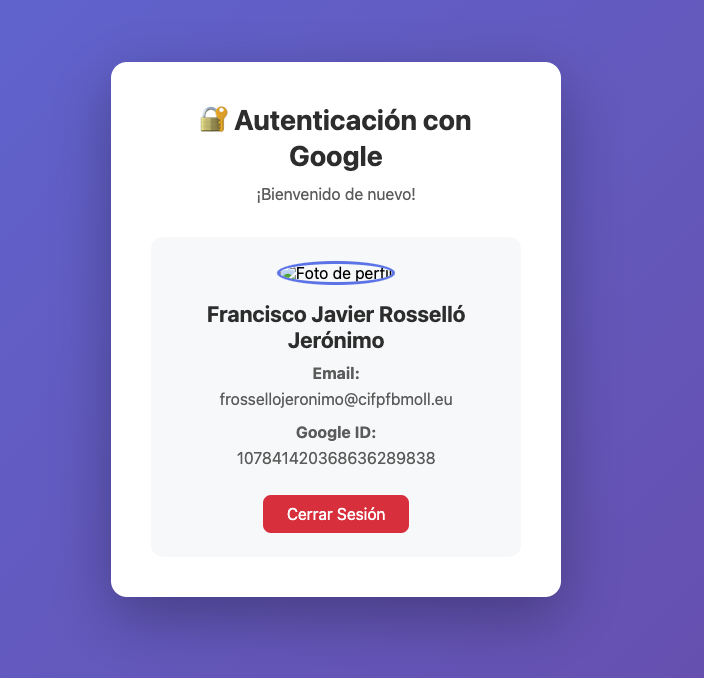

# 🔐 PHP Google OAuth Authentication

> Aplicación PHP completa que implementa autenticación OAuth 2.0 con Google, perfecta para aprender el flujo de autenticación y como base para proyectos reales.

[](https://php.net)
[](https://github.com/googleapis/google-api-php-client)
[](LICENSE)

## 📖 Tabla de Contenidos

- [Características](#-características)
- [Requisitos](#-requisitos)
- [Instalación Rápida](#-instalación-rápida)
- [Configuración Detallada](#-configuración-detallada)
- [Uso del Código](#-uso-del-código)
- [Estructura del Proyecto](#-estructura-del-proyecto)
- [API Reference](#-api-reference)
- [Ejemplos de Integración](#-ejemplos-de-integración)
- [Troubleshooting](#-troubleshooting)
- [Deployment](#-deployment)
- [Contribuir](#-contribuir)

## ✨ Características

- ✅ **OAuth 2.0 completo** - Implementación del flujo Authorization Code
- ✅ **Datos de usuario** - Obtiene email, nombre, foto y más información
- ✅ **Sesiones seguras** - Manejo robusto de sesiones PHP
- ✅ **UI moderna** - Interfaz limpia y responsive
- ✅ **Manejo de errores** - Páginas de error amigables y debugging
- ✅ **Tokens persistentes** - Soporte para refresh tokens
- ✅ **Fácil integración** - Listo para conectar con bases de datos
- ✅ **Documentación completa** - Código comentado y guías detalladas

## 📸 Capturas de Pantalla

### Página de Inicio - Login con Google


### Pantalla de Consentimiento de Google


### Perfil de Usuario Autenticado


## 📋 Requisitos

- **PHP**: 7.4 o superior (recomendado: 8.1+)
- **Composer**: Para gestión de dependencias
- **Cuenta Google Cloud**: Para credenciales OAuth
- **Servidor web**: Apache, Nginx o servidor integrado de PHP

## 🚀 Instalación Rápida

### 1. Clonar el Repositorio

```bash
git clone https://github.com/maximofernandezriera/php-google-auth.git
cd php-google-auth
```

### 2. Instalar Dependencias

```bash
composer install
```

### 3. Configurar Credenciales

```bash
# Copiar plantilla de configuración
cp config.example.php config.php

# Editar con tus credenciales (ver sección siguiente)
nano config.php  # o tu editor favorito
```

### 4. Ejecutar

```bash
# Servidor integrado de PHP
php -S localhost:8000

# Abrir en navegador
open http://localhost:8000  # macOS
# o visita manualmente http://localhost:8000
```

## ⚙️ Configuración Detallada

### Paso 1: Crear Proyecto en Google Cloud Console

1. **Acceder a Google Cloud Console**
   ```
   https://console.cloud.google.com/
   ```

2. **Crear nuevo proyecto**
   - Click en "Nuevo Proyecto"
   - Nombre: `php-google-auth-demo` (o el que prefieras)
   - Anotar el Project ID

3. **Habilitar APIs necesarias**
   ```
   APIs y servicios > Biblioteca > Buscar:
   - Google+ API (opcional, para compatibilidad)
   - Google OAuth2 API
   ```

### Paso 2: Configurar OAuth 2.0

1. **Pantalla de consentimiento OAuth**
   ```
   APIs y servicios > Pantalla de consentimiento OAuth
   
   Configuración:
   - Tipo de usuario: "Externo" (para desarrollo)
   - Nombre de la aplicación: "PHP Google Auth Demo"
   - Email de asistencia: tu-email@gmail.com
   - Dominios autorizados: localhost (opcional para desarrollo)
   - Ámbitos: ./auth/userinfo.email, ./auth/userinfo.profile
   ```

2. **Crear credenciales OAuth**
   ```
   APIs y servicios > Credenciales > Crear credenciales > ID de cliente OAuth
   
   Configuración:
   - Tipo: "Aplicación web"
   - Nombre: "PHP OAuth Client"
   - URIs de redirección autorizados:
     * http://localhost:8000/redirect.php
     * http://localhost:3000/redirect.php (opcional)
     * https://tu-dominio.com/redirect.php (para producción)
   ```

3. **Obtener credenciales**
   - Copiar el **Client ID** (termina en `.apps.googleusercontent.com`)
   - Copiar el **Client Secret** (empieza con `GOCSPX-`)

### Paso 3: Configurar config.php

Edita `config.php` con tus credenciales:

```php
<?php
return [
    'client_id' => 'TU_CLIENT_ID.apps.googleusercontent.com',
    'client_secret' => 'GOCSPX-TU_CLIENT_SECRET',
    'redirect_uri' => 'http://localhost:8000/redirect.php',
    'scopes' => [
        'email',
        'profile'
    ]
];
```

⚠️ **IMPORTANTE**: Nunca commitees `config.php` con credenciales reales.

## 💻 Uso del Código

### Estructura Básica del Flujo

```php
// 1. Usuario hace clic en "Login with Google" (index.php)
$authUrl = $client->createAuthUrl();

// 2. Google redirige a redirect.php con código
$code = $_GET['code'];

// 3. Intercambiar código por token
$token = $client->fetchAccessTokenWithAuthCode($code);

// 4. Obtener datos del usuario
$oauth2 = new Google_Service_Oauth2($client);
$userInfo = $oauth2->userinfo->get();

// 5. Guardar en sesión
$_SESSION['user'] = [
    'id' => $userInfo->id,
    'email' => $userInfo->email,
    'name' => $userInfo->name,
    // ... más datos
];
```

### Acceder a Datos del Usuario

Una vez autenticado, puedes acceder a los datos desde cualquier página:

```php
<?php
session_start();

if (isset($_SESSION['user'])) {
    $user = $_SESSION['user'];
    
    echo "ID de Google: " . $user['id'];           // Único, usar como PK
    echo "Email: " . $user['email'];               // Verificado por Google
    echo "Nombre: " . $user['name'];               // Nombre completo
    echo "Nombre: " . $user['given_name'];         // Solo nombre
    echo "Apellido: " . $user['family_name'];      // Solo apellido
    echo "Foto: " . $user['picture'];              // URL de la imagen
    echo "Email verificado: " . $user['verified_email']; // true/false
    echo "Idioma: " . $user['locale'];             // ej: 'es', 'en'
} else {
    echo "Usuario no autenticado";
}
?>
```

### Integración con Base de Datos

Ejemplo de cómo guardar usuarios en tu BD:

```php
// En redirect.php, después de obtener $userInfo
try {
    $pdo = new PDO('mysql:host=localhost;dbname=tu_bd', $user, $pass);
    
    $stmt = $pdo->prepare("
        INSERT INTO users (google_id, email, name, picture, created_at) 
        VALUES (?, ?, ?, ?, NOW())
        ON DUPLICATE KEY UPDATE 
            email = VALUES(email),
            name = VALUES(name),
            picture = VALUES(picture),
            last_login = NOW()
    ");
    
    $stmt->execute([
        $userInfo->id,
        $userInfo->email,
        $userInfo->name,
        $userInfo->picture
    ]);
    
    // Obtener ID interno del usuario
    $_SESSION['internal_user_id'] = $pdo->lastInsertId();
    
} catch (PDOException $e) {
    error_log("Error guardando usuario: " . $e->getMessage());
}
```

### Verificar si el Usuario está Logueado

Crea una función helper para usar en todas tus páginas:

```php
<?php
function isLoggedIn() {
    session_start();
    return isset($_SESSION['user']);
}

function requireLogin() {
    if (!isLoggedIn()) {
        header('Location: index.php');
        exit;
    }
}

function getUser() {
    return $_SESSION['user'] ?? null;
}

// Uso en tus páginas protegidas
requireLogin();
$user = getUser();
echo "Hola, " . htmlspecialchars($user['name']);
?>
```

## 📁 Estructura del Proyecto

```
php-google-auth/
├── composer.json          # Dependencias del proyecto
├── config.php            # Configuración OAuth (credenciales)
├── index.php             # Página principal con botón de login
├── redirect.php          # Callback de OAuth (procesa autenticación)
├── logout.php            # Cierra la sesión del usuario
├── .gitignore            # Archivos a ignorar en Git
└── README.md             # Este archivo
```

## 🔄 Flujo de Autenticación

### 1. **index.php** - Página Principal

Este archivo:
- Inicia una sesión PHP
- Carga el cliente de Google API
- Genera una URL de autenticación con `createAuthUrl()`
- Muestra un botón "Iniciar sesión con Google"
- Si el usuario ya está autenticado, muestra su información

**Código clave:**
```php
$client = new Google_Client();
$client->setClientId($config['client_id']);
$client->setClientSecret($config['client_secret']);
$client->setRedirectUri($config['redirect_uri']);
$client->addScope($config['scopes']);

$authUrl = $client->createAuthUrl();
```

### 2. **Redirección a Google**

Cuando el usuario hace clic en el botón:
- Es redirigido a Google
- Google muestra una pantalla de consentimiento
- El usuario autoriza los permisos (email y profile)

### 3. **redirect.php** - Callback de OAuth

Después de la autorización, Google redirige aquí con un código:

**Paso 1: Recibir el código**
```php
if (!isset($_GET['code'])) {
    header('Location: index.php');
    exit;
}
```

**Paso 2: Intercambiar código por token de acceso**
```php
$token = $client->fetchAccessTokenWithAuthCode($_GET['code']);
$client->setAccessToken($token);
```

Este es el paso más importante: el código de autorización es temporal y de un solo uso. Se intercambia por un **token de acceso** que permite hacer peticiones a la API de Google.

**Paso 3: Obtener información del usuario**
```php
$oauth2 = new Google_Service_Oauth2($client);
$userInfo = $oauth2->userinfo->get();
```

**Paso 4: Guardar datos en la sesión**
```php
$_SESSION['user'] = [
    'id' => $userInfo->id,
    'email' => $userInfo->email,
    'name' => $userInfo->name,
    'given_name' => $userInfo->givenName,
    'family_name' => $userInfo->familyName,
    'picture' => $userInfo->picture,
    'verified_email' => $userInfo->verifiedEmail,
    'locale' => $userInfo->locale
];
```

**Paso 5: Redirigir al inicio**
```php
header('Location: index.php');
```

## 👤 Acceder a los Datos del Usuario

Una vez autenticado, puedes acceder a los datos del usuario desde `$_SESSION['user']`:

### Datos Disponibles

```php
// ID único de Google del usuario
$userId = $_SESSION['user']['id'];

// Email verificado
$email = $_SESSION['user']['email'];

// Nombre completo
$fullName = $_SESSION['user']['name'];

// Nombre
$firstName = $_SESSION['user']['given_name'];

// Apellido
$lastName = $_SESSION['user']['family_name'];

// URL de la foto de perfil
$profilePicture = $_SESSION['user']['picture'];

// Email verificado (boolean)
$isVerified = $_SESSION['user']['verified_email'];

// Idioma preferido
$locale = $_SESSION['user']['locale'];
```

### Ejemplo de Uso

```php
<?php
session_start();

if (isset($_SESSION['user'])) {
    $user = $_SESSION['user'];
    
    // Iniciar sesión en tu sistema
    // Por ejemplo, buscar o crear usuario en tu base de datos
    
    echo "Bienvenido, " . htmlspecialchars($user['name']);
    echo "Tu email es: " . htmlspecialchars($user['email']);
    
    // Puedes usar el ID de Google como identificador único
    // para vincular con tu base de datos
    $googleId = $user['id'];
    
    // Ejemplo: guardar en base de datos
    // $db->query("INSERT INTO users (google_id, email, name) 
    //             VALUES (?, ?, ?) ON DUPLICATE KEY UPDATE ...");
} else {
    echo "No has iniciado sesión";
}
?>
```

## 🔒 Seguridad

### Buenas Prácticas Implementadas

1. **Sesiones PHP**: Los datos del usuario se almacenan en sesiones del servidor
2. **Validación de tokens**: Se verifica que el token sea válido
3. **HTTPS en producción**: Siempre usa HTTPS en producción
4. **Protección de credenciales**: `config.php` está en `.gitignore`
5. **Escape de HTML**: Se usa `htmlspecialchars()` para prevenir XSS

### Recomendaciones Adicionales

- **Producción**: Cambia `redirect_uri` a tu dominio real con HTTPS
- **Tokens de actualización**: Guarda `refresh_token` para mantener sesiones largas
- **Base de datos**: Almacena usuarios en una base de datos
- **Validación de email**: Verifica `verified_email` antes de confiar en el email
- **CSRF**: Implementa tokens CSRF para formularios críticos

## 🐛 Solución de Problemas

### Error: "redirect_uri_mismatch"

**Causa**: La URI de redirección no coincide con la configurada en Google Cloud Console.

**Solución**: 
- Verifica que `redirect_uri` en `config.php` sea exactamente igual a la configurada en Google Cloud Console
- Incluye el protocolo (`http://` o `https://`)
- No incluyas parámetros de consulta

### Error: "invalid_client"

**Causa**: El Client ID o Client Secret son incorrectos.

**Solución**: 
- Verifica que copiaste correctamente las credenciales
- Asegúrate de no tener espacios adicionales

### Error: "access_denied"

**Causa**: El usuario canceló la autorización.

**Solución**: Normal, el usuario decidió no autorizar. Maneja este caso en tu aplicación.

### La sesión no persiste

**Causa**: Las sesiones PHP no están configuradas correctamente.

**Solución**: 
- Verifica que `session_start()` esté al inicio de cada archivo
- Comprueba los permisos del directorio de sesiones PHP

## 🐞 Troubleshooting

- **Error 400 / invalid_client / redirect_uri_mismatch**: Verifica que el Client ID, Client Secret y redirect_uri en config.php coincidan exactamente con los registrados en Google Cloud Console.
- **Página en blanco**: Asegúrate de haber ejecutado `composer install` y que PHP esté en versión >=7.4.
- **La sesión no persiste**: Comprueba que `session_start()` está presente y que tu PHP guarda sesiones correctamente.
- **No se muestra el perfil tras login**: Revisa los logs y asegúrate de que el flujo de redirección y el intercambio de token funcionan correctamente.

## 🚢 Deployment

- Para producción, usa HTTPS y actualiza la redirect_uri en config.php y Google Cloud Console.
- Configura tu servidor web (Apache/Nginx) para servir el proyecto y proteger config.php.
- Revisa los permisos de archivos y directorios sensibles.

## 🤝 Contribuir

¿Quieres mejorar este proyecto? ¡Bienvenido!

1. Haz un fork y clona tu copia.
2. Crea una rama con tu mejora: `git checkout -b feature/nueva-funcionalidad`
3. Haz tus cambios y commitea: `git commit -am "Agrega nueva funcionalidad"`
4. Haz push y abre un Pull Request.

---

¿Dudas o sugerencias? Abre un issue en GitHub o contacta al autor.

## 📚 Recursos Adicionales

- [Documentación oficial de Google OAuth 2.0](https://developers.google.com/identity/protocols/oauth2)
- [Google API Client para PHP](https://github.com/googleapis/google-api-php-client)
- [Consola de Google Cloud](https://console.cloud.google.com/)

## 📝 Licencia

Este proyecto es de código abierto y está disponible bajo la licencia MIT.

---

**¿Necesitas ayuda?** Revisa la sección de solución de problemas o consulta la documentación oficial de Google.
